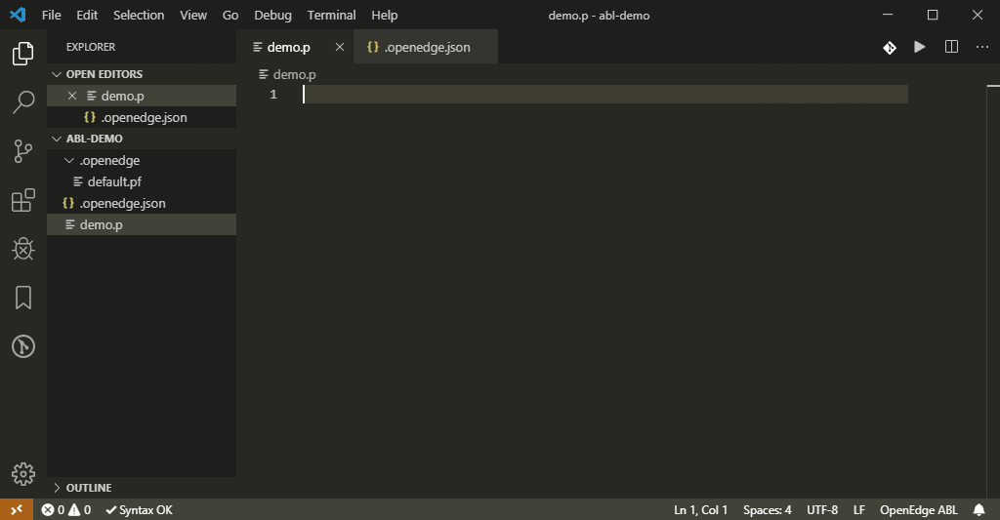
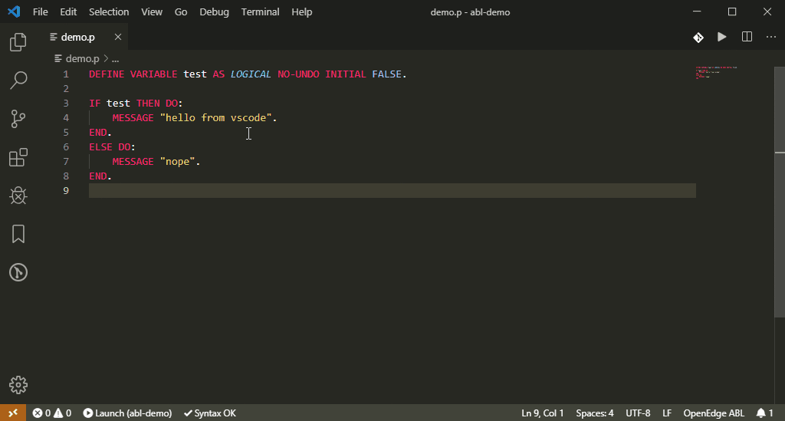
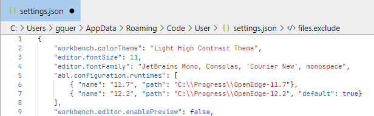

# OpenEdge ABL language support for Visual Studio Code (with Language Server support)
This extension provides rich OpenEdge ABL language support for Visual Studio Code. Now you can write and run ABL procedures using the excellent IDE-like interface that Visual Studio Code provides.

## Features

* Syntax highlighting
* Syntax checking
* Run
* Debugger
* Auto-complete (tables, fields, methods)





## Using

### Migration steps

Since version XXX, the `dlc` attribute is not used anymore in `.openedge.json`. OpenEdge runtimes have to be declared in the global VSCode configuration,
and the `OpenEdgeVersion` attribute has to reference one of those version numbers in `.openedge.json`.
### Prerequisites

OpenEdge runtimes have to be declared in VSCode configuration file. Open settings -> Extensions -> ABL Configuration -> Runtimes, or modify `settings.json`:


### Config file
You can create a local config file for your project named `.openedge.json`, with the following structure:
```JSON
{
    "workingDirectory": "${workspaceFolder}\\Home",
    "proPath": [
        "c:\\temp",
        "${workspaceFolder}"
    ],
    "dlc": "C:\\Progress\\OpenEdge", // *** Deprecated *** Use OpenEdgeVersion
    "OpenEdgeVersion": "12.2", // Reference to version number in global config
    "proPathMode": "append", // overwrite, prepend
    "parameterFiles": [ // -pf
        "default.pf"
    ],
    "startupProcedure" : "${workspaceFolder}/vsc-oe-startup.p",
    "dbDictionary": [
        "myDatabaseForAutoComplete"
    ],
    "format": {
        "trim": "right" // none
    }
}
```

`startupProcedure`, `proPath` and `workingDirectory` are optional. Default values:
- `startupProcedure`: ''
- `proPath`: workspaceRoot (of VSCode)
- `workingDirectory`: folder of active source code
- `dbDictionary` are the logical names of database files for the auto-complete option (command: ABL Read Dictionary Structure)
- `format` are formatter options

#### Parameter "startupProcedure"
The optional Startup Procedure for OpenEdge can be used to execute 4GL code before a check syntax/debug/run operation. Can be used to create Database aliases or instantiate Singleton Classes. The Procedure is executed everytime the IDE starts a check syntax/debug/run operation.

### Debugger
You can use the debugger to connect to a remote running process (assuming it is debug-ready), or run locally with debugger.

You first need to create the launch configuration in your `launch.json` file, 2 templates are available, one for launch and the other for attach).

```JSON
{
    "version": "0.2.0",
    "configurations": [
        {
            "name": "Attach to process",
            "type": "abl",
            "request": "attach",
            "address": "192.168.1.100",
            "port": 3099
        }
    ]
}
```

To attach to a remote process, it needs to be [debug-ready](https://documentation.progress.com/output/ua/OpenEdge_latest/index.html#page/asaps/attaching-the-debugger-to-an-appserver-session.html).
The easiest way to achieve that is to add `-debugReady 3099` to the startup parameters (`.pf` file) of your application server.

The debugger supports basic features
- step-over, step-into, step-out, continue, suspend
- breakpoints
- display stack
- display variables
- watch/evaluate basic expressions

You can map remote path to local path (1 to 1) using `localRoot` and `remoteRoot`. This is useful when debugging a remote target, even more if it only executes r-code.
`localRoot` is usually your `${workspaceRoot}` (current directory opened in VSCode). `remoteRoot` may remains empty (or missing), in this particular case, the remote path is relative, and resolved via the `PROPATH` by the remote.


You can also map different remote path to local path via source mapping `sourceMap`. This is useful if you don't have all the source code in a unique project (ex dependencies).

### Unit tests
Based upon the ABLUnit framework (need to be installed locally), you can specify launch parameters to find and execute test files
```
{
    "test": {
        "files":[
            "tests/*.test.p"
        ],
        "beforeEach": {
            "cmd": "%ProgramFiles%\\Git\\bin\\sh.exe",
            "args": [
                "-c",
                "echo starting"
            ]
        },
        "afterEach": {
            "cmd": "%ProgramFiles%\\Git\\bin\\sh.exe",
            "args": [
                "-c",
                "echo done"
            ]
        }
    }
}
```

## Greetings
Largely inspired by ZaphyrVonGenevese work (https://github.com/ZaphyrVonGenevese/vscode-abl).
Also inspired by vscode-go and vscode-rust extensions.

Thanks to all the contributors: mscheblein

## License
Licensed under the [MIT](LICENSE) License.
